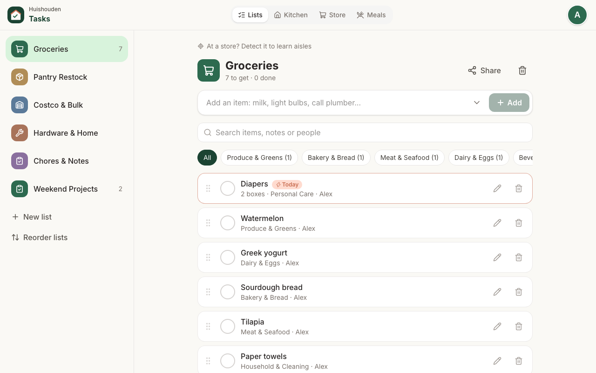
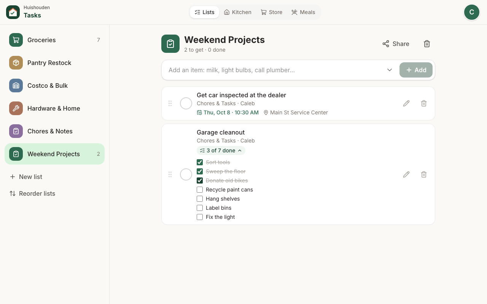
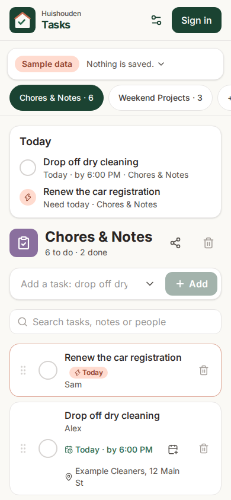

# Huishouden Tasks

Shared to-dos and chores. Every device in the household sees changes in real time and keeps working offline.

Part of [Huishouden](https://huishouden-piekstra.web.app), a suite of small household apps that share sign-in, the household and one design language ([huishouden-pwa-kit](https://github.com/huishouden/pwa-kit)). Live at https://huishouden-piekstra.web.app/tasks/; the old address, huishouden-tasks.web.app, redirects there.

Shopping lists, store mode and meal ideas are [Huishouden Groceries](https://huishouden-piekstra.web.app/groceries/) ([huishouden/groceries](https://github.com/huishouden/groceries)). Both apps read the household's same `lists` and `items`: to-do lists (`isTaskList` in `src/data/model.ts`: the chores and notes icons) are Tasks', every other list is Groceries'. Tasks' lists link there ("Shopping lists are in Groceries"), and old Tasks links to Kitchen, Store, Meals or a shopping list (`?mode=hub|store|meals`, `?list=<shopping list>`) open in Groceries with their query.

## Screens

| Lists (tablet) | A checklist |
| --- | --- |
|  |  |



**Lists** opens on **Today**: what is overdue or due today from every list, and anything marked Need today, each one tap from done. Typing "drop off dry cleaning before 6" or "cancel the trial by October 4th" sets the due time; a task can have steps, a place (Find nearby, from OpenStreetMap, with the place's opening hours: near you when location is allowed, otherwise near the household's home set in the portal) and a link, and "Find in my calendar" fills them from a Google Calendar event. Near the place of an unfinished errand, a one-line note says so. A task no longer needed can be cancelled from its details (admins, members, and whoever added it): it moves to Done marked Cancelled, and ticking it restores it.

Signed out, Tasks opens on an invented household (`src/data/demo.ts`): the real app on a Firestore that never goes online, so it can be tried without an account and nothing is saved. The screenshots are of that household; CI refreshes them after every deploy (`bun run screenshots`) and posts before/after images of the same scenes on every pull request.

<br clear="right">

## How it works

- **Sign-in:** Google accounts through Firebase Auth, in the suite's app bar (`@huishouden/pwa-kit/react/app-bar`), and silently (One Tap) when the browser is already signed in to Google. A household is a list of member emails shared by every Huishouden app; anyone in it can see and edit every list. Members are added in Huishouden or in Settings.
- **Google Calendar:** "Find in my calendar" reads events with a token from Google Identity Services (`@huishouden/pwa-kit/calendar`, `google-token`), asked for once from a tap and reused for its hour.
- **Data:** Cloud Firestore, cached on each device so the app opens instantly and works without a connection. Access is enforced by the household's Firestore rules, which live in [huishouden/rules](https://github.com/huishouden/rules); changes to what Tasks stores go there as a PR.
- **Household calendar, to-dos and reminders:** dated to-dos are published to the household agenda (`@huishouden/pwa-kit/agenda`), so the Huishouden portal's Calendar and Today show them with a link back to the item. Unfinished dated items get a push reminder an hour before their time, or at 9 on the morning of their day (`@huishouden/pwa-kit/reminders`, sent by huishouden/notify); each person turns notifications on per device in Settings. Every open item on a to-do list is also on the household to-do list (`@huishouden/pwa-kit/todos`), where the portal's To-do tab ticks it off (Done) or cancels it (Cancel) by writing the item itself. Any open device keeps all three in step a few seconds after a change (`src/data/publish.ts`).
- **Google Tasks:** something told to the Gemini app or Google Assistant ("remind me to call the plumber") lands in Google Tasks. In Settings a member connects Google Tasks (read-only, `@huishouden/pwa-kit/google-tasks`) and chooses which Google list feeds which to-do list (`households/{id}/settings/tasks`). New tasks are offered first ("New in Google Tasks", Add or Not this one). The settings document is shared with Groceries, which links Google lists to shopping lists: each app shows and changes only the links to its own lists and writes the others back unchanged, and a Google list Groceries takes shows as "Goes to <list> in Groceries". Tasks looks when it opens or comes back into view, only with a token the device already has, so for an hour after someone connects on that device; taken-in task ids are kept so a cleared item does not come back.
- **Writes:** through the kit's outbox (`@huishouden/pwa-kit/firestore`), so an item added just before the app closes is not lost.
- **Hosting:** `/tasks/` on the suite's one site (`huishouden-piekstra`, pwa-kit docs/one-site.md), with the other Huishouden apps.
- **Config:** CI builds read the Firebase web config from the repo's `VITE_FIREBASE_*` variables (public by design); local previews fall back to `/__/firebase/init.json`, which Hosting serves.
- **Updates:** every push to `main` runs the checks and deploys. Installed copies pick up a new version on their next launch, and check hourly while open.

## Privacy

Household data lives in the household's own Firestore documents, visible only to its members.
To catch problems early, the app sends reports to New Relic (free tier) through
`@huishouden/pwa-kit/observability`: errors (emails, ids, query strings and long numbers removed),
Core Web Vitals and page loads, the app version, device type, and the country and region New Relic
derives from the request; and anonymous usage counts per visit: `add item`, `check item`, `clear completed` and `create list`. Households are counted by a
hash of the id. No names, emails, entries, free text or precise location, and no cookie or stored
id: nothing links one visit to the next. When the browser sends Global Privacy Control or Do Not
Track, usage counts are skipped; errors and speed still go. Local builds, staging and automated
browsers send nothing. The page people see is
[huishouden-piekstra.web.app/privacy](https://huishouden-piekstra.web.app/privacy); details in pwa-kit
[docs/observability.md](https://github.com/huishouden/pwa-kit/blob/main/docs/observability.md).

## Develop

Requires [Bun](https://bun.sh), and Java 21+ for the Firestore emulator.

```sh
bun install                        # also enables the pre-commit leak scan (.githooks)
sh e2e/emulators/fetch-rules.sh && bunx firebase emulators:start --config e2e/emulators/firebase.json --only auth,firestore --project demo-huishouden-tasks   # terminal 1
VITE_USE_EMULATORS=true bun run dev                                                     # terminal 2
bun run verify       # types, design check, unit tests, build
bun run e2e:local    # signed-in browser flows against the emulators (starts them itself)
E2E_PORT_OFFSET=100 bun run e2e:local   # the same alongside another run: every port moved (steps of 10; e2e/ports.ts)
HH_E2E_TARGET=emulator BASE_URL=http://localhost:4173/tasks/ bun run e2e:emulator   # e2e/signed-in.spec.ts on running emulators, against an emulator build (VITE_FIREBASE_PROJECT_ID=demo-huishouden) in vite preview
bun run e2e          # smoke tests of the deployed site (read-only)
BASE_URL=http://localhost:5173/tasks/ bun run screenshots   # the README scenes of the signed-out sample household
```

Against the emulators, the app exposes `window.__testSignIn(email, name)`, which `e2e/` uses to sign in; it does not exist in production builds. `e2e/fixtures.ts` has the shared helpers: emulator reset, sign-in, slow-network emulation, error capture, and a stand-in for OpenStreetMap.

## CI/CD and releases

`.github/workflows/ci.yml` calls the kit's shared pipeline (`pwa.yml`) on every push to `main`: leak scan, design check, lint, unit tests and build, a keyless deploy of Hosting and smoke tests against the live site. Pull requests run no hosted CI: their author verifies them locally and on staging. `e2e:emulator` runs e2e/signed-in.spec.ts (each run in a household of its own) on the kit's emulators, before a PR is ready; a staging run (a manual `ci` run with `staging-ref`, or `bunx pwa-staging run`) runs only its `@staging` flows. This repo adds `app-tests` on `main`: the other signed-in browser flows against the Auth and Firestore emulators, using the current rules from huishouden/rules main (`RULES_REF=<branch>` tries a rules PR). Releases come from the kit's `release.yml` (release-please): Conventional Commit PR titles become `CHANGELOG.md` and tagged versions, and Settings shows the running version and build.

Deploys authenticate through Workload Identity Federation (no stored keys) with the repo variables `GCP_WIF_PROVIDER` and `GCP_DEPLOY_SA`, set by the kit's `infra/bootstrap.sh`.

## License

Source available under [PolyForm Shield 1.0.0](LICENSE): you may use, study and modify this code
for any purpose except providing a product that competes with Huishouden.

Huishouden and its logo are the project's brand; please don't use them for other products.
