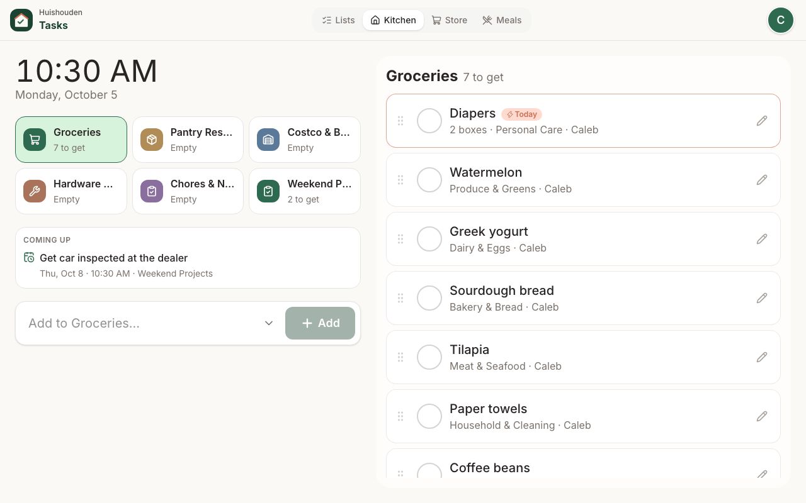
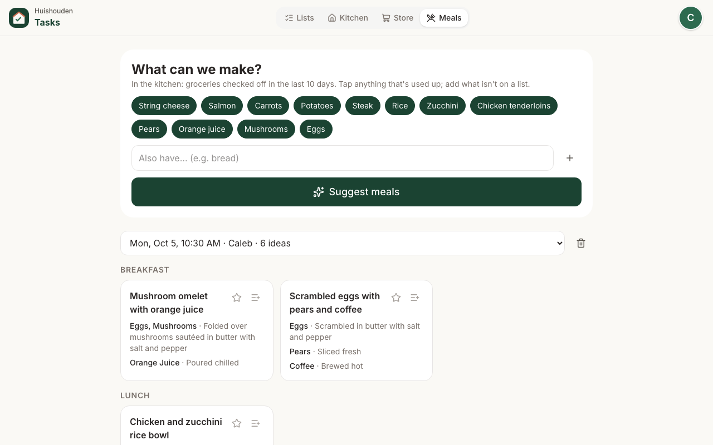
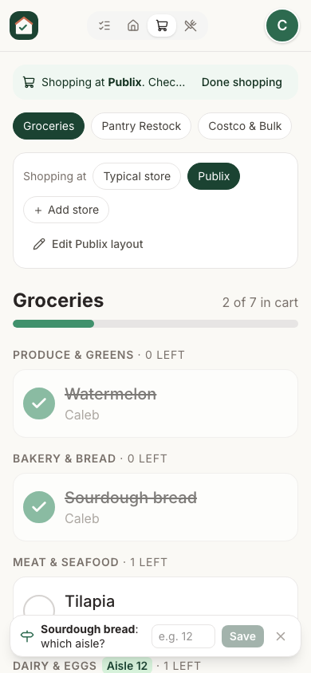

# Huishouden Tasks

Shared groceries, lists, chores and meal ideas for one household: an installable app for the kitchen tablet and phones. Every device sees changes in real time and keeps working offline.

Part of [Huishouden](https://huishouden-piekstra.web.app), a suite of small household apps that share sign-in, the household and one design language ([huishouden-pwa-kit](https://github.com/piekstra/huishouden-pwa-kit)). Live at https://huishouden-tasks.web.app.

## Screens

| Lists (tablet) | Kitchen hub (always-on tablet) |
| --- | --- |
|  |  |
| **Meals** from what was bought | **Tasks** with an appointment and a checklist |
|  |  |



**Store** mode on a phone walks the list in the chosen store's order. In a shop, a one-line banner asks whether you are at the store it found nearby (OpenStreetMap). While shopping, checking an item off offers an optional "which aisle?" at the bottom of the screen; aisles are remembered per store for the household, items are then grouped by aisle, and a wrong aisle can be corrected from the item.

The screenshots come from a sample household in the emulators. After a change to how the app looks, run `bun run screenshots:local` and commit the updated files in `docs/screenshots/`.

<br clear="right">

## How it works

- **Sign-in:** Google accounts through Firebase Auth. A household is a list of member emails; anyone in it can see and edit every list. Members are added in Settings.
- **Data:** Cloud Firestore, cached on each device so the app opens instantly and works without a connection. Access is enforced by `firestore.rules`.
- **Hosting:** the `huishouden-tasks` site in the shared `huishouden-piekstra` Firebase project, with the portal and Spending. This repo deploys the project's single `firestore.rules`; the other apps send their blocks here.
- **Config:** CI builds read the Firebase web config from the repo's `VITE_FIREBASE_*` variables (public by design); local previews fall back to `/__/firebase/init.json`, which Hosting serves.
- **Updates:** every push to `main` runs the checks and deploys. Installed copies pick up a new version on their next launch, and the always-on tablet checks hourly.

Four layouts share the same data: **Lists** for managing everything, **Kitchen** for the always-on tablet (large targets, screen kept awake), **Store** for checking items off aisle by aisle, and **Meals** for meal ideas.

**Meals** asks Gemini (through Firebase AI Logic, on the free Gemini Developer API tier) for breakfast, lunch, dinner and snack ideas built from groceries checked off in the last 10 days. The prompt, response schema and model live in `src/data/menus.ts`. Every suggested ingredient is checked in code against what was bought plus a short list of kitchen basics, and meals that use anything else are dropped. Saved ideas are shared with the household. AI Logic only accepts requests carrying an App Check token (reCAPTCHA Enterprise), so the API cannot be used from outside this site.

## Develop

Requires [Bun](https://bun.sh), and Java 21+ for the Firestore emulator.

```sh
bun install                        # also enables the pre-commit leak scan (.githooks)
bunx firebase emulators:start --only auth,firestore --project demo-huishouden-tasks   # terminal 1
VITE_USE_EMULATORS=true bun run dev                                                     # terminal 2
bun run verify       # types, design check, unit tests, security-rules tests, build
bun run e2e:local    # signed-in browser flows against the emulators (starts them itself)
bun run e2e          # smoke tests of the deployed site (read-only)
bun run e2e:ai       # real Gemini through the app's code (needs an App Check debug token, see below)
bun run screenshots:local   # regenerate docs/screenshots from a sample household
bun scripts/menu-probe.ts "eggs, steak, rice"   # try the menu prompt against Gemini
```

`e2e:ai` and `menu-probe.ts` read an App Check debug token from `~/.config/huishouden-tasks/appcheck-debug-token`. Register one under App Check → Apps → Tasks → Manage debug tokens, and keep it out of the repo.

Against the emulators, the app exposes `window.__testSignIn(email, name)`, which `e2e/` uses to sign in; it does not exist in production builds. `e2e/fixtures.ts` has the shared helpers: emulator reset, sign-in, slow-network emulation, error capture, and a stand-in for OpenStreetMap.

## CI/CD and releases

`.github/workflows/ci.yml` calls the kit's shared pipeline (`pwa.yml`): leak scan, design check, lint, unit tests and build on every pull request and push; on `main`, a keyless deploy of Hosting and smoke tests against the live site. This repo adds `app-tests` (rules and emulator browser flows) and, on `main`, deploys `firestore.rules`. Releases come from the kit's `release.yml` (release-please): Conventional Commit PR titles become `CHANGELOG.md` and tagged versions, and Settings shows the running version and build.

Deploys authenticate through Workload Identity Federation (no stored keys) with the repo variables `GCP_WIF_PROVIDER` and `GCP_DEPLOY_SA`, set by the kit's `infra/bootstrap.sh`.
